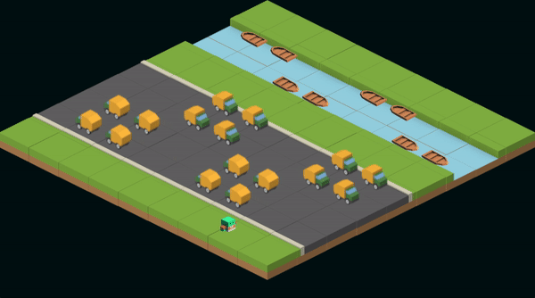

# jaywalking


A JavaScript game created using [React](https://reactnative.dev) and [Recoil](https://recoiljs.org).

## Gif



## Setup

1. Clone the repository.

2. Install the project:

```
cd jaywalking && npm i
```

3. start the project:

```
npm start
```

## Contributing

Pull requests are welcome. For major changes, please open an issue first.

## License

MIT &copy; [memonsahil](https://github.com/memonsahil)
