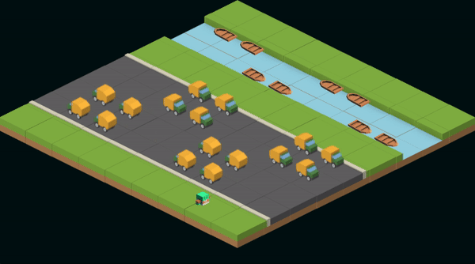

# jaywalking


A game created using [React](https://reactnative.dev) and [Recoil](https://recoiljs.org).

## Demo



## Setup

1. Install the project using npm:

```
$ cd jaywalking && npm install
```

2. Start the project:

```
$ npm start
```

## Contributing

Pull requests are welcome. For major changes, please open an issue first.

## License

MIT &copy; [memonsahil](https://github.com/memonsahil)
